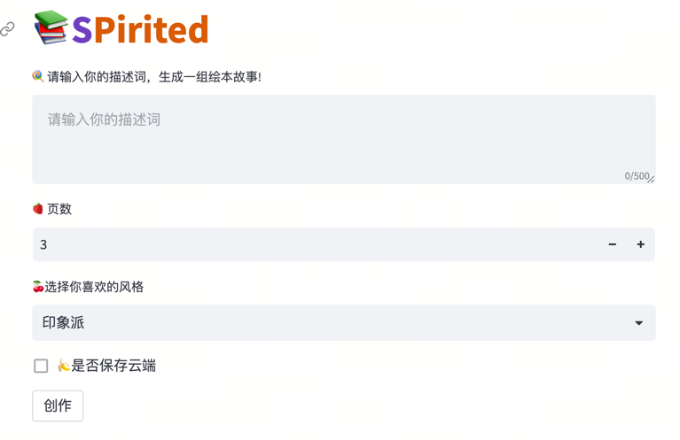

# SPirited 一款AI儿童绘本生成程序



## 项目简介
一句话生成一本书。

这是一个基于 GPT、Langchain、Function Calling 和 Stable Diffusion 技术实现的 AI 代理应用程序，旨在生成儿童绘本故事。

## 功能特点

- **一句话生成一本书**：用户只需输入一句话便可生成一本丰富多彩的儿童故事书。

- **随声朗读**：Coming soon。（生成符合故事情节的文字、语音朗读，有种身临其境的感觉。）

- **GPT 驱动**：利用 GPT（OpenAI、LLama2、ChatGLM等） 技术，生成富有创意的绘本故事，使其充满乐趣和想象力。

- **Function Calling 支持**：使用 Function Calling 技术，可以自定义绘本中的交互和功能，增加互动性。

- **Stable Diffusion 稳定扩散**：确保生成的故事内容具有一致性和连贯性，提供高质量的绘本。

## 如何使用

以下是使用本项目的基本步骤：

1. **安装依赖**：
```python
    pip install -r requirements.txt
```

2. **配置参数**：在配置文件conf.env中设置项目所需的参数，ACTIVELOOP_TOKEN、DATASET_PATH、STABILITY等。

3. **运行程序**： 运行程序并生成儿童绘本故事。启动命令：
```angular2html
    streamlit run app.py
```

## 示例

```python
# 示例代码，展示如何使用程序生成绘本
from book_maker import BookMaker
from dotenv import load_dotenv

load_dotenv('conf.env')

inputs = 'a cute girl is running near the river and singing and jumping'
    model_name = 'gpt-3.5-turbo-0613'
    style = 'Monet, impressionist art style, loose brushstrokes, vibrant colors, painted, painted light'
    app = BookMaker(inputs, model_name, style)

    story_pages = ["Title: Lily's Joyful Adventure\n\n",
                   "\nLily skips along the river's bend,\nHer laughter echoing with every bend.\nShe twirls and sings "
                   "a merry tune,\nUnder the golden sun and a sky so blue.\n\n",
                   "\nThe river sparkles with a magical glow,\nAs Lily's feet dance to and fro.\nShe jumps over "
                   "pebbles, oh so small,\nAnd splashes in the water, having a ball.\n\nAmidst the green trees and "
                   "flowers so bright,\nLily's joy shines with all her might.\nShe sings with the birds, "
                   "their melodies entwined,\nAs she explores the wonders she's destined to find.\n\n",
                   "\nThe wind whispers secrets through the trees,\nAs Lily's laughter floats on the breeze.\nShe "
                   "leaps over rocks, as graceful as a fawn,\nAnd makes friends with creatures, big and small.\n\nA "
                   "bunny hops by, its fluffy tail so spry,\nWhile a squirrel chatters, scampering up high.\nLily "
                   "giggles and joins in their playful game,\nAs they all frolic together, without any shame.\n\nWith "
                   "each bound and skip, she fills the air,\nWith joy and happiness, beyond compare.\nLily's "
                   "adventure, so full of glee,\nIs a reminder for all to be wild and free.\n\nEnd of story."
                   ]
    # app.make_pages_prompt(story_pages)
    app.runner()
```

# 贡献
我们欢迎贡献者加入项目并提出改进意见。如果你有任何想法或问题，请提交 Issue 或发起 Pull Request。

# 许可证
此项目采用 MIT 许可证。

如果您对这个项目有任何问题或建议，请随时联系我们。


